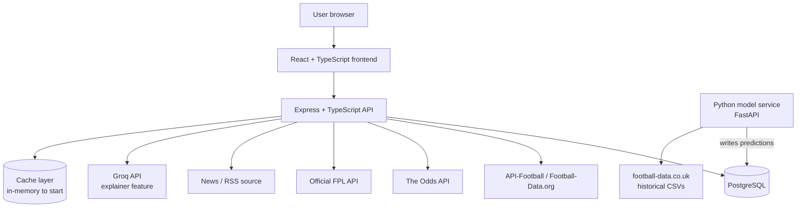
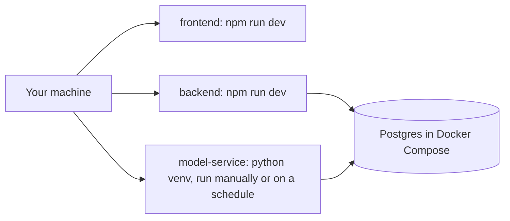
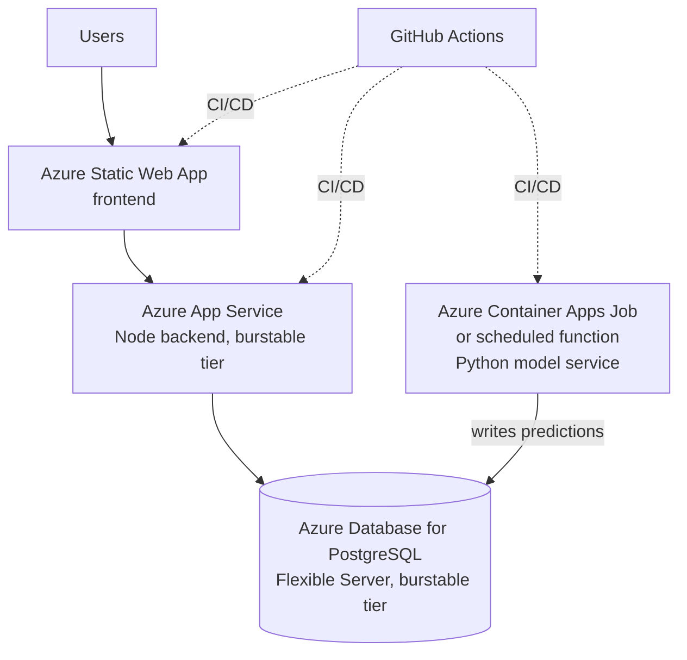

# Architecture

Keep this updated whenever a component is added or the flow changes. This is
the diagram to call back to when re-orienting on how things fit together.

## System overview (current target)

Notes:
- **Data scope is wider than the app's user-facing surface.** The database
  holds Premier League + Championship + FA Cup, 3 seasons, including
  lineups/players — but the frontend and the Express API's own endpoints
  only ever surface Premier League. The extra competitions exist purely as
  training data for the model service (more matches for the same teams
  across promotion/relegation, cup-form signal). Phase 2's endpoint design
  should filter to Premier League by default rather than exposing all
  competitions the schema happens to support.
- The **model service is separate from the Node backend on purpose** — it
  trains on historical data and writes predictions to Postgres on a
  schedule (batch inference). The Express API just reads predictions like
  any other table; it never calls the model directly in the request path.
  This mirrors how real ML-in-production systems are usually structured.
- The cache layer starts as a simple in-process cache (e.g. a TTL map) —
  no Redis until we actually feel the need for it across multiple backend
  instances.
- Groq API calls go through a caching check first (common explainer
  queries shouldn't hit the API twice).

## Local development

No cloud dependency required for local dev — most phases should run
entirely local, including training and running the model on your machine.

## Deployment target (Phase 10)

## Scaling path (documented, not pre-built)

| Component | Current | Next step when needed |
|---|---|---|
| Backend | Single App Service, burstable | Bump plan tier, then scale out to multiple instances |
| Database | Single Flexible Server, burstable | Bump compute tier, then add a read replica |
| Cache | In-process TTL map | Redis (Azure Cache for Redis) once >1 backend instance |
| Model service | Scheduled batch job | Move to real-time serving only if a feature actually needs live inference |
| Static assets | Served via Static Web App | Add CDN if latency becomes an issue |

50 concurrent users should be comfortable on the "current" column across the
board — no need to reach for the "next step" column until there's a real
signal.
