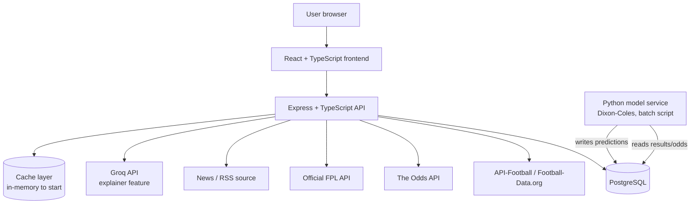
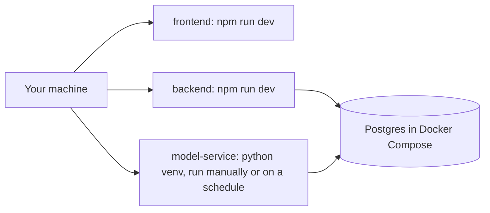
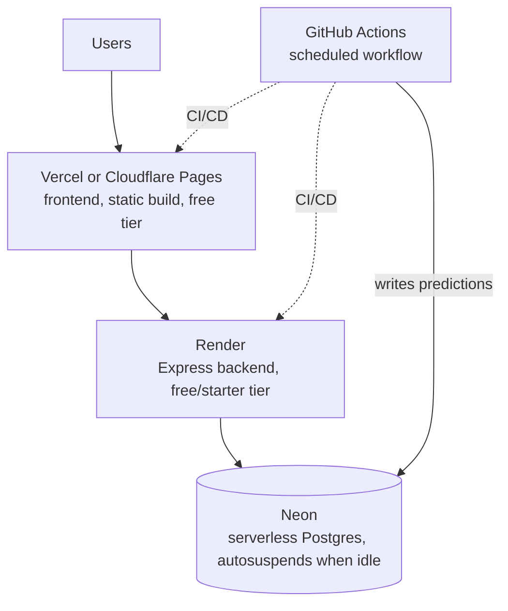

# Architecture

Keep this updated whenever a component is added or the flow changes. This is
the diagram to call back to when re-orienting on how things fit together.

## System overview (current target)

Notes:
- **The model reads from Postgres, not raw CSVs directly.** Earlier drafts of
  this diagram showed the model pulling straight from football-data.co.uk —
  in practice it reads the same already-seeded `fixtures`/`fixture_odds`
  tables the backend does, via `model-service/app/data.py`. One source of
  truth for match results, not two independent paths that could drift out
  of sync with each other.
- **Data scope is wider than the app's user-facing surface, but dashboards
  and predictions aren't PL-only.** The database holds Premier League +
  Championship + FA Cup, 3 seasons, including lineups/players. **Team
  dashboards cover Premier League and Championship.** Match predictions are
  produced by **one joint Dixon-Coles fit across Premier League,
  Championship, and FA Cup together** — see `docs/learning-log.md`'s Phase
  5/7 entries for why a single joint fit was needed (two independent
  single-competition fits each land on their own arbitrary scale, with
  nothing tying a Premier League team's numbers to a Championship team's;
  FA Cup fixtures are the actual connecting data that makes the joint scale
  meaningful, since they're the only matches where the two leagues play
  each other). The frontend still only *displays* Premier League and
  Championship — FA Cup predictions exist in the database but aren't a
  surfaced app feature, a deliberate scope boundary. Fantasy stays Premier
  League only (not a scope choice — FPL has no Championship data to show),
  and so does the betting tracker for now. See `docs/CLAUDE.md`'s "Data
  scope vs. app scope" for the full breakdown. Phase 2's endpoint design
  should filter accordingly rather than exposing every competition the
  schema supports.
- The **model service is separate from the Node backend on purpose** — it
  trains on historical data and writes predictions to Postgres on a
  schedule (batch inference). The Express API just reads predictions like
  any other table; it never calls the model directly in the request path.
  This mirrors how real ML-in-production systems are usually structured.
- The cache layer starts as a simple in-process cache (e.g. a TTL map) —
  no Redis until we actually feel the need for it across multiple backend
  instances.
- Groq API calls go through a caching check first (common explainer
  queries shouldn't hit the API twice).
- **One deliberate exception to "services only read Postgres":**
  `GET /api/fpl/my-team` (Phase 4) calls FPL's public entry endpoints
  *live, per request*, not through the batch seed pipeline. Squad picks are
  single-user, low-volume, and change weekly (transfers) — pre-seeding them
  the way historical fixtures are seeded would mean the data is stale the
  moment a transfer happens, for no caching benefit (there's no rate-limit
  budget to protect here the way there is for API-Football). Everything
  else in the API still only reads Postgres; this is the one place a
  request handler reaches out to a third party directly, and it's
  deliberate, not a crack in the pattern.

## Keeping data current (designed in Phase 1, script built 2026-08-15, scheduling deferred to Phase 10)

The seed pipeline (`backend/seed/`) populates historical data once, but the
*current* season keeps moving: new fixtures get scheduled, results go
final, and the model's predictions go stale without a refit. The script
exists and is merged, but it isn't running on a schedule yet -- and won't
be until Phase 10, deliberately. It was originally meant to run via the
local machine's `cron`/`launchd` in the meantime, but since Phase 10
swaps in a GitHub Actions scheduled workflow running the exact same
commands, that local scheduling step would just get set up and torn down
again a short while later. Not worth doing twice -- see the note below.
Until then it only runs when invoked by hand:

- **No new fetching logic needed.** Every seed source module already does
  idempotent upserts (`ON CONFLICT ... DO UPDATE`), so "refresh" is just
  rerunning the existing functions scoped to the *current* competition-season
  only, instead of all 3 historical seasons:
  - `seedApiFootballFixtures` for the current competition-season (one cheap
    call, picks up newly scheduled/completed fixtures and updates `status`)
    followed by `backfillLineupsForCompetitionSeason` — already resumable,
    and now only ever considers `status = 'finished'` fixtures, so a match
    that went final since the last run becomes a real backfill candidate
    the moment its status is refreshed.
  - `linkHistoricalSeasonsToApiFootball` (called at the start of
    `backfillLineups`) now skips a season entirely once nothing's left to
    link, via a cheap `EXISTS` check -- it used to unconditionally
    re-upsert all 3 historical PL/Championship seasons (~2,700 DB
    round-trips) on every single call, which would have made the daily job
    pay that cost forever even once fully caught up.
  - `python -m app.train` (model-service) refits Dixon-Coles on the fresh
    data and writes new predictions.
  - football-data.co.uk and FPL bootstrap are *not* part of the daily
    refresh — football-data.co.uk's CSV only ever reflects matches already
    played (nothing "current" to re-pull daily) and FPL's bootstrap-static
    changes slowly enough that a manual `npm run db:seed` rerun covers it.
- **`backend/scripts/daily-refresh.sh`** runs `npm run db:seed:current-season`
  → `npm run db:seed:backfill-lineups` → `python -m app.train`, in that
  order (order matters: the backfill only sees a fixture as a candidate
  once its status says `finished`, so the fixture-list refresh has to run
  first). Written to run under either a local `cron`/`launchd` entry or a
  GitHub Actions scheduled workflow -- same script, same commands, only
  the trigger differs. **Decided 2026-08-16: skip the local `cron`/
  `launchd` step entirely and wire this up once, in Phase 10, as the
  GitHub Actions workflow.** The local-scheduler step was only ever a
  stopgap for "before the app is deployed" -- since Phase 10 was always
  going to replace it with the exact same commands under a different
  trigger, scheduling it locally now would mean setting it up and tearing
  it down again shortly after, for no real benefit. Until Phase 10, the
  script only runs when invoked by hand.
- **What this explicitly doesn't cover**: live/in-play score updates (this
  app is not building a live-score ticker) and live betting odds (Phase 6,
  The Odds API, a separate concern from historical odds).

## Local development

No cloud dependency required for local dev — most phases should run
entirely local, including training and running the model on your machine.

## Deployment target (Phase 10)

**Config built and merged 2026-08-16** (`render.yaml`, `frontend/vercel.json`,
`.github/workflows/ci.yml`, `.github/workflows/daily-refresh.yml`) --
**not yet actually live**. See `docs/deployment.md` for the runbook;
everything below describes the target, most of which now exists as
config in the repo, with account creation/connecting/secrets as the
remaining manual steps only a human can do.

Originally planned around Azure's managed tiers, but reconsidered for cost:
Azure's cheapest *always-on* Postgres + App Service combo runs roughly
$25-40/mo before any real traffic. This project's actual scale (~50
concurrent users at most, mostly personal use) fits a stack of serverless/
free tiers that scale down to near-$0 between visits far better than a
fixed-cost VM-shaped stack does.

- **Frontend — Vercel or Cloudflare Pages.** Free static hosting for the
  Vite/React build, CDN-backed by default (no separate "add a CDN" step,
  unlike Azure Static Web Apps).
- **Backend — Render.** Free tier spins the Express API down after ~15
  minutes idle (adds cold-start latency on the next request); the $7/mo
  starter tier keeps it always-on if that latency ever actually bothers
  anyone. Either way, a fraction of App Service's minimum cost.
- **Database — Neon.** Serverless Postgres with a genuinely useful free
  tier: it **autosuspends compute when idle**, so cost tracks actual usage
  rather than a fixed monthly floor the way Azure's Flexible Server does.
  Same `DATABASE_URL`-based connection this project already uses locally —
  migrations, seed scripts, and the dump/restore snapshot all work
  unchanged, just pointed at a different connection string.
- **Model service — GitHub Actions scheduled workflow, not a hosted
  service.** The model service was always designed as scheduled batch
  inference, never a request/response API (see the notes above) — a free
  Actions cron job that runs the training/prediction script and writes to
  Neon satisfies that exactly, with no compute to pay for at all. Worth
  knowing: Actions minutes are metered on private repos (free/unlimited on
  public ones) and scheduled runs can be delayed a few minutes under
  GitHub's own load — fine for "predictions ready well before kickoff,"
  not fine for anything latency-sensitive.

## Scaling path (documented, not pre-built)

| Component | Current | Next step when needed |
|---|---|---|
| Backend | Render free/starter tier | Bump to a larger Render plan, then scale out to multiple instances |
| Database | Neon free tier (autosuspend) | Bump to Neon's paid always-on compute tier, then consider a read replica |
| Cache | In-process TTL map | A hosted Redis (e.g. Upstash's serverless free tier) once >1 backend instance |
| Model service | GitHub Actions scheduled workflow | Move to a dedicated worker (e.g. a Render background worker) only if a feature needs faster/more frequent runs than Actions scheduling supports |
| Static assets | Served via Vercel/Cloudflare Pages | Already CDN-backed by default — no next step here |

50 concurrent users should be comfortable on the "current" column across the
board — no need to reach for the "next step" column until there's a real
signal.
