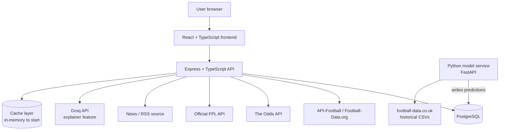
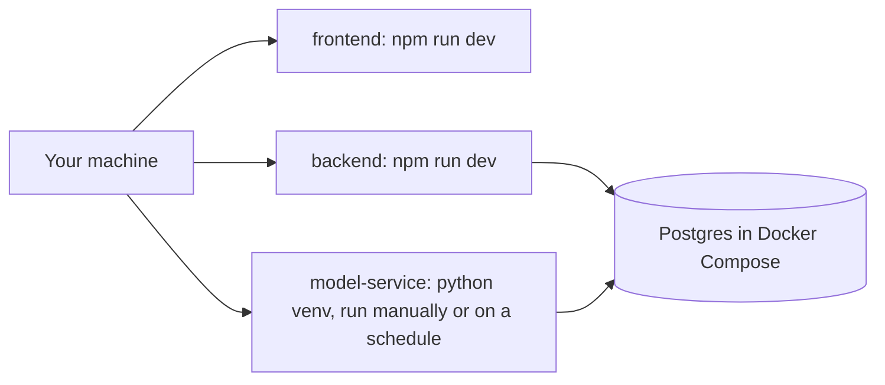
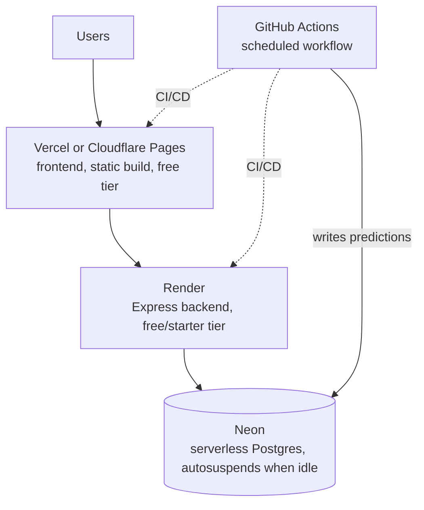

# Architecture

Keep this updated whenever a component is added or the flow changes. This is
the diagram to call back to when re-orienting on how things fit together.

## System overview (current target)

Notes:
- **Data scope is wider than the app's user-facing surface, but dashboards
  and predictions aren't PL-only.** The database holds Premier League +
  Championship + FA Cup, 3 seasons, including lineups/players. **Team
  dashboards and match predictions cover Premier League and Championship,
  plus FA Cup fixtures where both teams are in one of those two tiers** —
  most FA Cup matchups from the Third Round on qualify. An FA Cup fixture
  against a team outside PL/Championship (no historical data to model
  against) gets a default logo and the team name, no score prediction.
  Fantasy stays Premier League only (not a scope choice — FPL has no
  Championship data to show), and so does the betting tracker for now. See
  `docs/CLAUDE.md`'s "Data scope vs. app scope" for the full breakdown.
  Phase 2's endpoint design should filter accordingly rather than exposing
  every competition the schema supports.
- The **model service is separate from the Node backend on purpose** — it
  trains on historical data and writes predictions to Postgres on a
  schedule (batch inference). The Express API just reads predictions like
  any other table; it never calls the model directly in the request path.
  This mirrors how real ML-in-production systems are usually structured.
- The cache layer starts as a simple in-process cache (e.g. a TTL map) —
  no Redis until we actually feel the need for it across multiple backend
  instances.
- Groq API calls go through a caching check first (common explainer
  queries shouldn't hit the API twice).

## Keeping data current (designed in Phase 1, built in Phase 2)

The seed pipeline (`backend/seed/`) populates historical data once. Once
Phase 2's API exists and the app has an actual reason to see fresh data,
something needs to keep the *current* season current: new fixtures as
they're scheduled, results as they go final, FPL prices/ownership (which
shift daily in-season). This is deliberately not built yet — a refresh job
with nothing reading its output is premature — but the shape is settled:

- **No new fetching logic needed.** Every seed source module already does
  idempotent upserts (`ON CONFLICT ... DO UPDATE`), so "refresh" is just
  rerunning the existing functions scoped to the *current* competition-season
  only, instead of all 3 historical seasons:
  - `seedFootballDataSeason` for the current PL/Championship season (results
    + odds go final match by match).
  - `seedFplBootstrap` — always current-season by nature of what FPL is.
  - `seedApiFootballFixtures` for the current competition-season (one cheap
    call, picks up newly scheduled/completed fixtures) followed by
    `backfillLineupsForCompetitionSeason` — already resumable, and already
    skips fixtures that haven't changed, so pointing it at "this week's
    matches" instead of "3 years of history" is the same function, smaller
    input.
- **Scheduling**: locally, a cron entry or manual periodic run is enough.
  Once deployed (Phase 10), this is the same pattern as the model service's
  scheduled batch job — a GitHub Actions scheduled workflow, not a new
  architectural concept.
- **What this explicitly doesn't cover yet**: live/in-play score updates
  (this app is not building a live-score ticker) and live betting odds
  (Phase 6, The Odds API, a separate concern from historical odds).

## Local development

No cloud dependency required for local dev — most phases should run
entirely local, including training and running the model on your machine.

## Deployment target (Phase 10)

Originally planned around Azure's managed tiers, but reconsidered for cost:
Azure's cheapest *always-on* Postgres + App Service combo runs roughly
$25-40/mo before any real traffic. This project's actual scale (~50
concurrent users at most, mostly personal use) fits a stack of serverless/
free tiers that scale down to near-$0 between visits far better than a
fixed-cost VM-shaped stack does.

- **Frontend — Vercel or Cloudflare Pages.** Free static hosting for the
  Vite/React build, CDN-backed by default (no separate "add a CDN" step,
  unlike Azure Static Web Apps).
- **Backend — Render.** Free tier spins the Express API down after ~15
  minutes idle (adds cold-start latency on the next request); the $7/mo
  starter tier keeps it always-on if that latency ever actually bothers
  anyone. Either way, a fraction of App Service's minimum cost.
- **Database — Neon.** Serverless Postgres with a genuinely useful free
  tier: it **autosuspends compute when idle**, so cost tracks actual usage
  rather than a fixed monthly floor the way Azure's Flexible Server does.
  Same `DATABASE_URL`-based connection this project already uses locally —
  migrations, seed scripts, and the dump/restore snapshot all work
  unchanged, just pointed at a different connection string.
- **Model service — GitHub Actions scheduled workflow, not a hosted
  service.** The model service was always designed as scheduled batch
  inference, never a request/response API (see the notes above) — a free
  Actions cron job that runs the training/prediction script and writes to
  Neon satisfies that exactly, with no compute to pay for at all. Worth
  knowing: Actions minutes are metered on private repos (free/unlimited on
  public ones) and scheduled runs can be delayed a few minutes under
  GitHub's own load — fine for "predictions ready well before kickoff,"
  not fine for anything latency-sensitive.

## Scaling path (documented, not pre-built)

| Component | Current | Next step when needed |
|---|---|---|
| Backend | Render free/starter tier | Bump to a larger Render plan, then scale out to multiple instances |
| Database | Neon free tier (autosuspend) | Bump to Neon's paid always-on compute tier, then consider a read replica |
| Cache | In-process TTL map | A hosted Redis (e.g. Upstash's serverless free tier) once >1 backend instance |
| Model service | GitHub Actions scheduled workflow | Move to a dedicated worker (e.g. a Render background worker) only if a feature needs faster/more frequent runs than Actions scheduling supports |
| Static assets | Served via Vercel/Cloudflare Pages | Already CDN-backed by default — no next step here |

50 concurrent users should be comfortable on the "current" column across the
board — no need to reach for the "next step" column until there's a real
signal.
