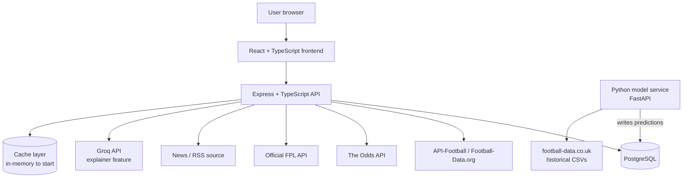
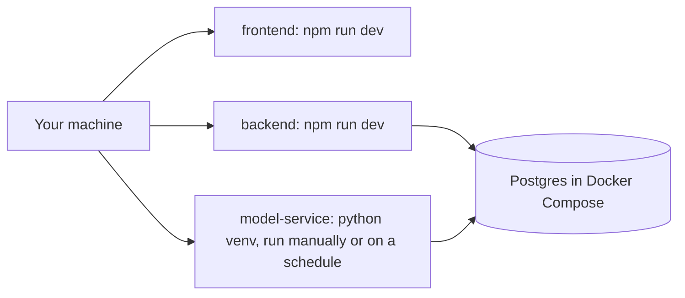
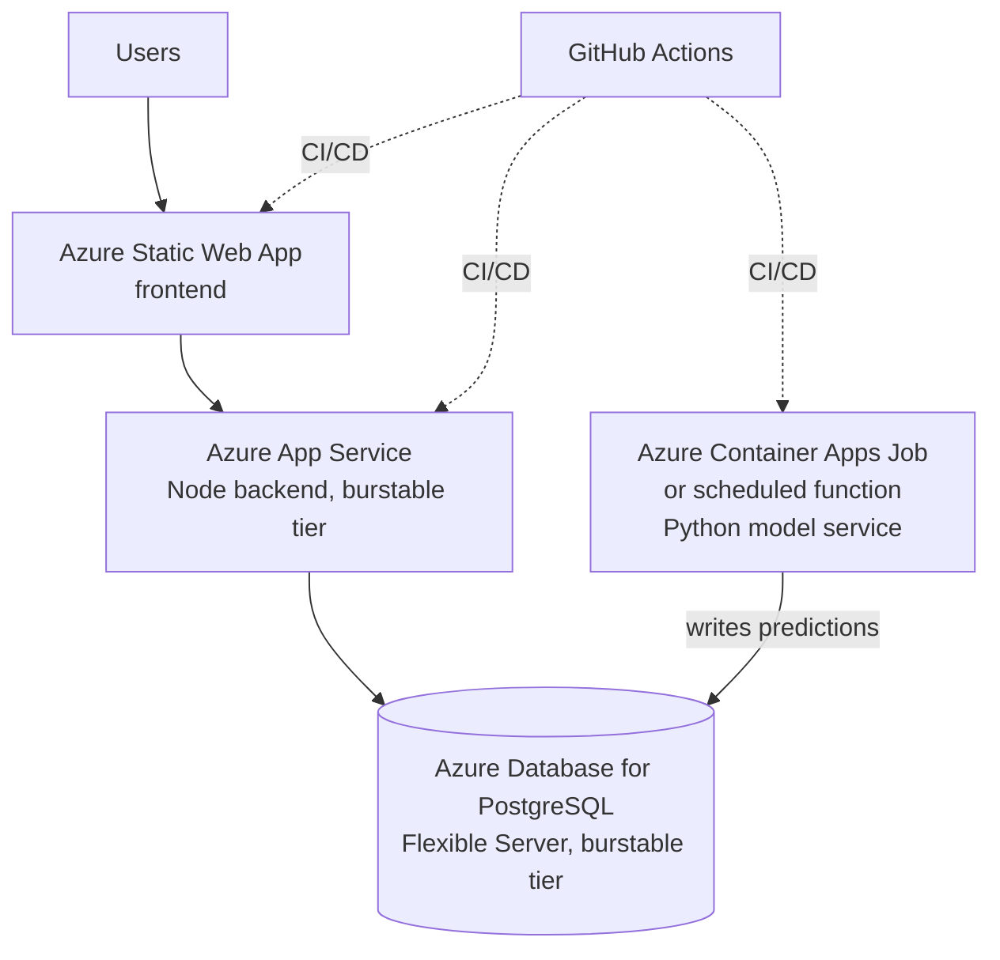

# Architecture

Keep this updated whenever a component is added or the flow changes. This is
the diagram to call back to when re-orienting on how things fit together.

## System overview (current target)

Notes:
- **Data scope is wider than the app's user-facing surface, but predictions
  aren't PL-only.** The database holds Premier League + Championship + FA
  Cup, 3 seasons, including lineups/players. Team dashboards, fantasy, and
  the betting tracker stay Premier League only. **Match predictions cover
  Premier League and Championship, plus FA Cup fixtures where both teams are
  in one of those two tiers** — most FA Cup matchups from the Third Round on
  qualify. An FA Cup fixture against a team outside PL/Championship (no
  historical data to model against) gets a default logo and the team name,
  no score prediction — see `docs/CLAUDE.md`'s "Data scope vs. app scope"
  for the full breakdown. Phase 2's endpoint design should filter
  accordingly rather than exposing every competition the schema supports.
- The **model service is separate from the Node backend on purpose** — it
  trains on historical data and writes predictions to Postgres on a
  schedule (batch inference). The Express API just reads predictions like
  any other table; it never calls the model directly in the request path.
  This mirrors how real ML-in-production systems are usually structured.
- The cache layer starts as a simple in-process cache (e.g. a TTL map) —
  no Redis until we actually feel the need for it across multiple backend
  instances.
- Groq API calls go through a caching check first (common explainer
  queries shouldn't hit the API twice).

## Keeping data current (designed in Phase 1, built in Phase 2)

The seed pipeline (`backend/seed/`) populates historical data once. Once
Phase 2's API exists and the app has an actual reason to see fresh data,
something needs to keep the *current* season current: new fixtures as
they're scheduled, results as they go final, FPL prices/ownership (which
shift daily in-season). This is deliberately not built yet — a refresh job
with nothing reading its output is premature — but the shape is settled:

- **No new fetching logic needed.** Every seed source module already does
  idempotent upserts (`ON CONFLICT ... DO UPDATE`), so "refresh" is just
  rerunning the existing functions scoped to the *current* competition-season
  only, instead of all 3 historical seasons:
  - `seedFootballDataSeason` for the current PL/Championship season (results
    + odds go final match by match).
  - `seedFplBootstrap` — always current-season by nature of what FPL is.
  - `seedApiFootballFixtures` for the current competition-season (one cheap
    call, picks up newly scheduled/completed fixtures) followed by
    `backfillLineupsForCompetitionSeason` — already resumable, and already
    skips fixtures that haven't changed, so pointing it at "this week's
    matches" instead of "3 years of history" is the same function, smaller
    input.
- **Scheduling**: locally, a cron entry or manual periodic run is enough.
  Once deployed (Phase 10), this is the same pattern as the model service's
  scheduled batch job — Azure Container Apps Jobs or a scheduled function,
  not a new architectural concept.
- **What this explicitly doesn't cover yet**: live/in-play score updates
  (this app is not building a live-score ticker) and live betting odds
  (Phase 6, The Odds API, a separate concern from historical odds).

## Local development

No cloud dependency required for local dev — most phases should run
entirely local, including training and running the model on your machine.

## Deployment target (Phase 10)

## Scaling path (documented, not pre-built)

| Component | Current | Next step when needed |
|---|---|---|
| Backend | Single App Service, burstable | Bump plan tier, then scale out to multiple instances |
| Database | Single Flexible Server, burstable | Bump compute tier, then add a read replica |
| Cache | In-process TTL map | Redis (Azure Cache for Redis) once >1 backend instance |
| Model service | Scheduled batch job | Move to real-time serving only if a feature actually needs live inference |
| Static assets | Served via Static Web App | Add CDN if latency becomes an issue |

50 concurrent users should be comfortable on the "current" column across the
board — no need to reach for the "next step" column until there's a real
signal.
