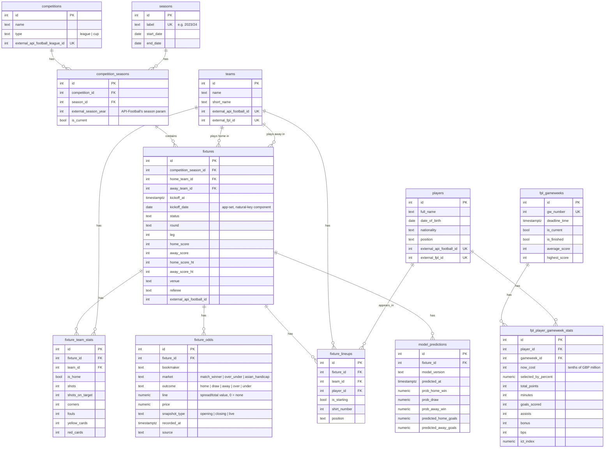

# Database schema (ERD)

Created in Phase 1. Update this any time `backend/migrations/` changes —
this should always match what the migrations actually create.

## Diagram

## Design decisions worth remembering

- **Teams are global, not scoped to a competition or season.** The same
  team plays across Premier League, Championship, and FA Cup, and moves
  between PL/Championship via promotion/relegation. Scoping a team row to
  one competition would mean the same real club gets multiple disconnected
  rows.
- **`fixtures` is deduped on a natural key, not an external id.**
  `UNIQUE (competition_season_id, home_team_id, away_team_id, kickoff_date)`
  is the target both the football-data.co.uk importer and the API-Football
  importer upsert against. The two sources have no shared ID space for the
  same real match — keying on `external_api_football_id` alone would give
  every football-data.co.uk-sourced match a second, duplicate row once the
  API-Football importer runs against the same fixture. `kickoff_date` is set
  explicitly by the seed scripts (not derived by Postgres) so both importers
  agree on it even if their exact kickoff-time precision differs.
- **Players have the same entity-resolution problem as fixtures, solved the
  same way.** FPL and API-Football assign unrelated IDs to the same real
  person, so `players` carries both `external_fpl_id` and
  `external_api_football_id` as independent nullable columns, populated
  whichever source we see the player from first and reconciled by the seed
  script (name/team/nationality matching), not guaranteed by the schema.
- **`fixture_odds` is intentionally EAV-shaped** (`bookmaker`/`market`/
  `outcome`/`line` rather than fixed columns per bookmaker). Roughly 8
  bookmakers x several markets x opening/closing snapshots per fixture
  doesn't fit fixed columns without a schema change every time a bookmaker
  or market type is added. The tradeoff: reading this back out for model
  training needs a pivot query/view to get a wide dataframe — that's a
  Phase 5 concern, not a Phase 1 one.
- **No stored/materialized standings table.** A league table is fully
  derivable from `fixtures` (wins/draws/losses, goal difference) on demand.
  Storing it would be redundant derived data that can silently drift from
  the source of truth for no current benefit — add a materialized view
  later only if computing it live actually becomes a measured performance
  problem.
- **No `fixture_events` table yet** (goals, cards, substitutions with
  minute/player detail). Phase 1's checklist only asks for lineups; goal
  scorer prediction (Phase 7) is what actually needs event-level data, and
  building it now would be speculative. Same reasoning for leaving
  `minutes_played` off `fixture_lineups` — API-Football serves it from a
  separate per-fixture statistics endpoint that would double the free-tier
  lineup backfill for no current payoff.
- **No `bets` table yet.** PHASES.md schedules the betting tracker at
  Phase 6. It'll look roughly like
  `bets(id, fixture_id, market, selection, odds_decimal, stake, result, placed_at, settled_at)`
  — deliberately with **no `user_id`**, since CLAUDE.md describes this as a
  single-user personal tracker throughout, not "waiting on Phase 9 auth."
  Add a `user_id` later only if that assumption changes.
- **Migrations are plain SQL** (`backend/migrations/*.sql`, run via
  `node-pg-migrate`), not an ORM's schema DSL. The point of this phase is
  to actually read and write real DDL, not have it generated — `.sql`-mode
  node-pg-migrate gives migration ordering and a bookkeeping table
  (`pgmigrations`) for free without abstracting away the SQL itself.
