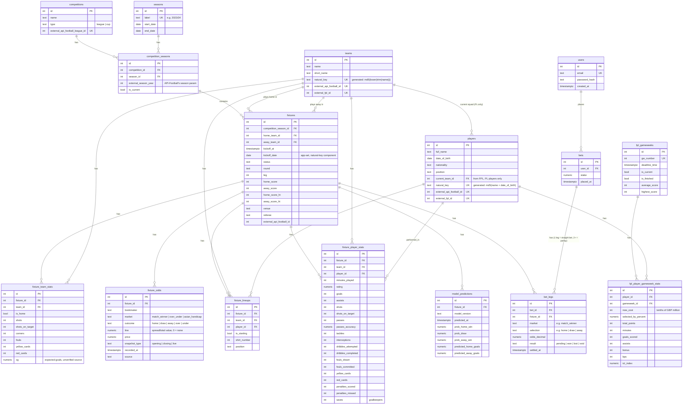

# Database schema (ERD)

Created in Phase 1. Update this any time `backend/migrations/` changes —
this should always match what the migrations actually create.

## Diagram

## Design decisions worth remembering

- **Teams are global, not scoped to a competition or season.** The same
  team plays across Premier League, Championship, and FA Cup, and moves
  between PL/Championship via promotion/relegation. Scoping a team row to
  one competition would mean the same real club gets multiple disconnected
  rows.
- **`fixtures` is deduped on a natural key, not an external id.**
  `UNIQUE (competition_season_id, home_team_id, away_team_id, kickoff_date)`
  is the target both the football-data.co.uk importer and the API-Football
  importer upsert against. The two sources have no shared ID space for the
  same real match — keying on `external_api_football_id` alone would give
  every football-data.co.uk-sourced match a second, duplicate row once the
  API-Football importer runs against the same fixture. `kickoff_date` is set
  explicitly by the seed scripts (not derived by Postgres) so both importers
  agree on it even if their exact kickoff-time precision differs.
- **Teams and players use a "golden record" pattern: a deterministic
  `natural_key`, generated by Postgres itself, that any source can compute
  independently and land on the same row.** `teams.natural_key` is
  `md5(lower(trim(name)))` — name alone, deliberately not a stadium/location
  (those get renamed for sponsorship; hashing one in would make the "same"
  team's key change over time, defeating the point). `players.natural_key`
  is `md5(full_name + date_of_birth)` — not position, which isn't a stable
  identity attribute and doesn't disambiguate two same-name players anyway.
  Both are `GENERATED ALWAYS ... STORED` columns, not hashed in application
  code, specifically so the key can never drift out of sync with what's
  actually in the row. One real wrinkle: Postgres requires a generated
  column's expression to be IMMUTABLE, which ruled out both pgcrypto's
  `digest()` (not marked immutable) and `date_of_birth::text` (depends on
  session `DateStyle`) — `md5()` and an epoch-day integer offset
  (`date_of_birth - date '1970-01-01'`) are the immutable equivalents used
  instead. A player seen without a known DOB (typical from API-Football's
  lineup endpoint, which gives a name and shirt number but not a birth date)
  falls back to a name-only match against an existing row before creating
  one under the DOB-less key — see `upsertPlayerGoldenRecord` in
  `backend/seed/lib/db.ts`. `external_fpl_id` and `external_api_football_id`
  remain as separate nullable enrichment columns on top of this, populated
  by whichever source provides them.
- **`fixture_odds` is intentionally EAV-shaped** (`bookmaker`/`market`/
  `outcome`/`line` rather than fixed columns per bookmaker). Roughly 8
  bookmakers x several markets x opening/closing snapshots per fixture
  doesn't fit fixed columns without a schema change every time a bookmaker
  or market type is added. The tradeoff: reading this back out for model
  training needs a pivot query/view to get a wide dataframe — that's a
  Phase 5 concern, not a Phase 1 one.
- **No stored/materialized standings table, but a `team_fixture_results`
  view.** A league table is fully derivable from `fixtures` (wins/draws/
  losses, goal difference) on demand. Storing it would be redundant derived
  data that can silently drift from the source of truth — add a
  materialized view later only if computing it live actually becomes a
  measured performance problem. The view exists purely to make that
  derivation easy: it unpivots `fixtures` + `fixture_team_stats` into one
  row per team per fixture (home and away both from the team's own
  perspective — `goals_for`/`goals_against`/`result`/`points`, not
  home/away), so season aggregates, rolling form, or model features are a
  `GROUP BY team_id` / window function over `kickoff_date` away instead of
  hand-written home-vs-away `CASE` logic in every query that wants them.
  Verified against real data: querying it for the 2023/24 season reproduces
  the actual final Premier League table exactly (Man City 91 points,
  champions; Arsenal 89; Liverpool 82; ...).
- **`fixture_team_stats.xg` (expected goals)** was added as a nullable
  column, unpopulated for now. football-data.co.uk's CSVs don't include it;
  API-Football's fixture-statistics endpoint may, but that's unconfirmed
  and would be a second per-fixture API call on top of lineups — the same
  rate-limit-cost tradeoff as `minutes_played`, not decided yet.
- **`fixture_player_stats` added later than the rest of Phase 1**, once the
  model's need for per-fixture player performance (goals/assists/cards/
  minutes, not just who played) was worth the cost of a second API-Football
  call per fixture on top of lineups — accepted deliberately alongside a
  plan to pay for a higher API-Football tier, rather than defaulted into.
  `minutes_played` lives here, not on `fixture_lineups`, since it comes from
  this endpoint, not the lineups one.
- **Still no `fixture_events` table** (goal-by-goal/card-by-card timeline
  with exact minute). `fixture_player_stats` covers per-fixture *totals*
  (a player had 1 goal, 2 assists), which is enough for Phase 5's match
  outcome model; a minute-by-minute event timeline is a Phase 7 (goal
  scorer prediction) need specifically, not built speculatively now.
- **`players.current_team_id`**, added while building Phase 2's team
  dashboard endpoint: there was no way to answer "who's on this team" at
  all, since `fixture_lineups` (the eventual real source of truth) is empty
  until the paid-tier API-Football backfill runs. FPL's bootstrap-static
  already carries a player's current team directly and is always live, so
  it populates this column — but only for Premier League players (FPL has
  no Championship data). Championship squads stay empty until lineups are
  backfilled; a known, documented gap, not a bug in the dashboard endpoint.
- **`users`/`bets`/`bet_legs`**, added Phase 6. Originally designed
  single-user with no `user_id` at all (see git history); revised
  mid-Phase-6 once real multi-user login was actually wanted, pulling
  Phase 9's auth work forward rather than building it twice.
  `bets(id, user_id FK, stake, placed_at)` is just the container — who
  placed it, how much. The picks themselves live in
  `bet_legs(id, bet_id FK, fixture_id FK, market, selection, odds_decimal,
  result, settled_at)`, one row per leg: a straight bet is a bet with
  exactly one leg, a parlay has several. `bets` deliberately has **no**
  `result`, `odds_decimal`, or `settled_at` column — the overall result,
  combined odds, and payout are *derived* from the legs at query time
  (any lost leg loses the whole bet; a void leg is dropped from the
  combined price, same rule a real sportsbook uses), not stored
  redundantly, the same "derive, don't duplicate" reasoning already behind
  `team_fixture_results` being a view rather than a table. `market`/
  `selection` stay free text (mirroring `fixture_odds`'s `market`/`outcome`
  shape) so a new bet type never needs a migration. `result` is a Postgres
  `CHECK` constraint, not a foreign-keyed lookup table — four fixed values
  (`pending`/`won`/`lost`/`void`) that never grow, unlike `market`/
  `selection`. `users.password_hash` is a bcrypt hash, never a plaintext
  password — one-way by design, verified at login via `bcrypt.compare`,
  never decrypted.
- **Migrations are plain SQL** (`backend/migrations/*.sql`, run via
  `node-pg-migrate`), not an ORM's schema DSL. The point of this phase is
  to actually read and write real DDL, not have it generated — `.sql`-mode
  node-pg-migrate gives migration ordering and a bookkeeping table
  (`pgmigrations`) for free without abstracting away the SQL itself.
