# Database schema (ERD)

Created in Phase 1. Update this any time `backend/migrations/` changes —
this should always match what the migrations actually create.

## Diagram

```mermaid
erDiagram
    competitions ||--o{ competition_seasons : has
    seasons ||--o{ competition_seasons : has
    competition_seasons ||--o{ fixtures : contains
    teams ||--o{ fixtures : "plays home in"
    teams ||--o{ fixtures : "plays away in"
    fixtures ||--o{ fixture_team_stats : has
    teams ||--o{ fixture_team_stats : has
    fixtures ||--o{ fixture_odds : has
    fixtures ||--o{ fixture_lineups : has
    teams ||--o{ fixture_lineups : has
    players ||--o{ fixture_lineups : appears_in
    teams ||--o{ players : "current squad (PL only)"
    players ||--o{ player_external_ids : "known as"
    fixtures ||--o{ fixture_player_stats : has
    teams ||--o{ fixture_player_stats : has
    players ||--o{ fixture_player_stats : performed_in
    fpl_gameweeks ||--o{ fpl_player_gameweek_stats : has
    players ||--o{ fpl_player_gameweek_stats : has
    fixtures ||--o{ model_predictions : has
    fixtures ||--o{ player_goal_predictions : has
    players ||--o{ player_goal_predictions : "predicted to score"
    teams ||--o{ player_goal_predictions : has
    fixtures ||--o{ bet_legs : has
    users ||--o{ bets : places
    bets ||--o{ bet_legs : "has (1 leg = straight bet, 2+ = parlay)"

    competitions {
        int id PK
        text name
        text type "league | cup"
        int external_api_football_league_id UK
    }
    seasons {
        int id PK
        text label UK "e.g. 2023/24"
        date start_date
        date end_date
    }
    competition_seasons {
        int id PK
        int competition_id FK
        int season_id FK
        int external_season_year "API-Football's season param"
        bool is_current
    }
    teams {
        int id PK
        text name
        text short_name
        text logo_url "from API-Football's fixtures/lineups responses"
        text natural_key UK "generated: md5(lower(trim(name)))"
        int external_api_football_id UK
        int external_fpl_id UK
    }
    players {
        int id PK
        text full_name
        date date_of_birth
        text nationality
        text position
        text photo_url "from API-Football's fixtures/players response"
        int current_team_id FK "from FPL, PL players only"
        text natural_key UK "generated: md5(name + date_of_birth)"
        int external_api_football_id UK "the 'api_football' id space, specifically"
        int external_fpl_id UK
    }
    player_external_ids {
        int id PK
        int player_id FK
        text source "'fpl' | 'api_football' | 'api_football_squads' -- UNIQUE with external_id"
        int external_id
    }
    fixtures {
        int id PK
        int competition_season_id FK
        int home_team_id FK
        int away_team_id FK
        timestamptz kickoff_at
        date kickoff_date "app-set, natural-key component"
        text status
        text round
        int leg
        int home_score
        int away_score
        int home_score_ht
        int away_score_ht
        text venue
        text referee
        int external_api_football_id
        timestamptz lineups_checked_at "set once lineups/stats attempted, win or lose -- distinguishes 'no data available' from 'not tried yet'"
    }
    fixture_team_stats {
        int id PK
        int fixture_id FK
        int team_id FK
        bool is_home
        int shots
        int shots_on_target
        int corners
        int fouls
        int yellow_cards
        int red_cards
        numeric xg "expected goals, unverified source"
    }
    fixture_odds {
        int id PK
        int fixture_id FK
        text bookmaker
        text market "match_winner | over_under | asian_handicap"
        text outcome "home | draw | away | over | under"
        numeric line "spread/total value, 0 = none"
        numeric price
        text snapshot_type "opening | closing | live"
        timestamptz recorded_at
        text source
    }
    fixture_lineups {
        int id PK
        int fixture_id FK
        int team_id FK
        int player_id FK
        bool is_starting
        int shirt_number
        text position
    }
    fixture_player_stats {
        int id PK
        int fixture_id FK
        int team_id FK
        int player_id FK
        int minutes_played
        numeric rating
        int goals
        int assists
        int shots
        int shots_on_target
        int passes
        numeric passes_accuracy
        int tackles
        int interceptions
        int dribbles_attempted
        int dribbles_completed
        int fouls_drawn
        int fouls_committed
        int yellow_cards
        int red_cards
        int penalties_scored
        int penalties_missed
        int saves "goalkeepers"
    }
    fpl_gameweeks {
        int id PK
        int gw_number UK
        timestamptz deadline_time
        bool is_current
        bool is_finished
        int average_score
        int highest_score
    }
    fpl_player_gameweek_stats {
        int id PK
        int player_id FK
        int gameweek_id FK
        int now_cost "tenths of GBP million"
        numeric selected_by_percent
        int total_points
        int minutes
        int goals_scored
        int assists
        int bonus
        int bps
        numeric ict_index
    }
    model_predictions {
        int id PK
        int fixture_id FK
        text model_version
        timestamptz predicted_at
        numeric prob_home_win
        numeric prob_draw
        numeric prob_away_win
        numeric predicted_home_goals
        numeric predicted_away_goals
    }
    player_goal_predictions {
        int id PK
        int fixture_id FK
        int player_id FK
        int team_id FK
        text model_version
        timestamptz predicted_at
        numeric expected_goals "lambda_player: team_xg x goal_share x minutes_share"
        numeric prob_scores "1 - e^(-expected_goals)"
    }
    users {
        int id PK
        text email UK
        text password_hash
        timestamptz created_at
        int fpl_entry_id "nullable -- this user's own FPL team, self-linked"
    }
    bets {
        int id PK
        int user_id FK
        numeric stake
        timestamptz placed_at
        numeric odds_override_decimal "optional -- the book's own parlay price"
    }
    bet_legs {
        int id PK
        int bet_id FK
        int fixture_id FK
        text market "e.g. match_winner"
        text selection "e.g. home | draw | away"
        numeric odds_decimal
        text result "pending | won | lost | void"
        timestamptz settled_at
    }
```

## Design decisions worth remembering

- **Teams are global, not scoped to a competition or season.** The same
  team plays across Premier League, Championship, and FA Cup, and moves
  between PL/Championship via promotion/relegation. Scoping a team row to
  one competition would mean the same real club gets multiple disconnected
  rows.
- **`fixtures` is deduped on a natural key, not an external id.**
  `UNIQUE (competition_season_id, home_team_id, away_team_id, kickoff_date)`
  is the target both the football-data.co.uk importer and the API-Football
  importer upsert against. The two sources have no shared ID space for the
  same real match — keying on `external_api_football_id` alone would give
  every football-data.co.uk-sourced match a second, duplicate row once the
  API-Football importer runs against the same fixture. `kickoff_date` is set
  explicitly by the seed scripts (not derived by Postgres) so both importers
  agree on it even if their exact kickoff-time precision differs.
- **`fixtures.lineups_checked_at` tracks "attempted", separately from
  "succeeded".** Discovered for real 2026-08-15: without it, the lineup
  backfill's "still missing" query (`NOT EXISTS fixture_lineups ...`)
  can't tell a fixture API-Football genuinely has no lineup data for
  (common for FA Cup's non-league early rounds) apart from one that just
  hasn't been tried yet -- every rerun re-attempted the same permanently-
  empty fixtures forever, and "0 remaining" never meant what it sounded
  like. Only ever set for `status = 'finished'` fixtures, so a match that
  simply hasn't been played yet stays a real candidate instead of being
  wrongly marked unavailable.
- **Teams and players use a "golden record" pattern: a deterministic
  `natural_key`, generated by Postgres itself, that any source can compute
  independently and land on the same row.** `teams.natural_key` is
  `md5(lower(trim(name)))` — name alone, deliberately not a stadium/location
  (those get renamed for sponsorship; hashing one in would make the "same"
  team's key change over time, defeating the point). `players.natural_key`
  is `md5(full_name + date_of_birth)` — not position, which isn't a stable
  identity attribute and doesn't disambiguate two same-name players anyway.
  Both are `GENERATED ALWAYS ... STORED` columns, not hashed in application
  code, specifically so the key can never drift out of sync with what's
  actually in the row. One real wrinkle: Postgres requires a generated
  column's expression to be IMMUTABLE, which ruled out both pgcrypto's
  `digest()` (not marked immutable) and `date_of_birth::text` (depends on
  session `DateStyle`) — `md5()` and an epoch-day integer offset
  (`date_of_birth - date '1970-01-01'`) are the immutable equivalents used
  instead. A player seen without a known DOB (typical from API-Football's
  lineup endpoint, which gives a name and shirt number but not a birth date)
  falls back to a name-only match against an existing row before creating
  one under the DOB-less key — see `upsertPlayerGoldenRecord` in
  `backend/seed/lib/db.ts`. `external_fpl_id` and `external_api_football_id`
  remain as separate nullable enrichment columns on top of this, populated
  by whichever source provides them.
- **`fixture_odds` is intentionally EAV-shaped** (`bookmaker`/`market`/
  `outcome`/`line` rather than fixed columns per bookmaker). Roughly 8
  bookmakers x several markets x opening/closing snapshots per fixture
  doesn't fit fixed columns without a schema change every time a bookmaker
  or market type is added. The tradeoff: reading this back out for model
  training needs a pivot query/view to get a wide dataframe — that's a
  Phase 5 concern, not a Phase 1 one.
- **No stored/materialized standings table, but a `team_fixture_results`
  view.** A league table is fully derivable from `fixtures` (wins/draws/
  losses, goal difference) on demand. Storing it would be redundant derived
  data that can silently drift from the source of truth — add a
  materialized view later only if computing it live actually becomes a
  measured performance problem. The view exists purely to make that
  derivation easy: it unpivots `fixtures` + `fixture_team_stats` into one
  row per team per fixture (home and away both from the team's own
  perspective — `goals_for`/`goals_against`/`result`/`points`, not
  home/away), so season aggregates, rolling form, or model features are a
  `GROUP BY team_id` / window function over `kickoff_date` away instead of
  hand-written home-vs-away `CASE` logic in every query that wants them.
  Verified against real data: querying it for the 2023/24 season reproduces
  the actual final Premier League table exactly (Man City 91 points,
  champions; Arsenal 89; Liverpool 82; ...).
- **`fixture_team_stats.xg` (expected goals)** was added as a nullable
  column, unpopulated for now. football-data.co.uk's CSVs don't include it;
  API-Football's fixture-statistics endpoint may, but that's unconfirmed
  and would be a second per-fixture API call on top of lineups — the same
  rate-limit-cost tradeoff as `minutes_played`, not decided yet.
- **`fixture_player_stats` added later than the rest of Phase 1**, once the
  model's need for per-fixture player performance (goals/assists/cards/
  minutes, not just who played) was worth the cost of a second API-Football
  call per fixture on top of lineups — accepted deliberately alongside a
  plan to pay for a higher API-Football tier, rather than defaulted into.
  `minutes_played` lives here, not on `fixture_lineups`, since it comes from
  this endpoint, not the lineups one.
- **Still no `fixture_events` table** (goal-by-goal/card-by-card timeline
  with exact minute). `fixture_player_stats` covers per-fixture *totals*
  (a player had 1 goal, 2 assists), which is enough for Phase 5's match
  outcome model; a minute-by-minute event timeline is a Phase 7 (goal
  scorer prediction) need specifically, not built speculatively now.
- **`players.current_team_id`**, added while building Phase 2's team
  dashboard endpoint: there was no way to answer "who's on this team" at
  all, since `fixture_lineups` (the eventual real source of truth) is empty
  until the paid-tier API-Football backfill runs. FPL's bootstrap-static
  already carries a player's current team directly and is always live, so
  it populates this column — but only for Premier League players (FPL has
  no Championship data). **Fixed 2026-08-18** (`teams.service.ts`'s
  `getSquad`): Championship squads used to just be empty because of that
  gap, until the Bets page's anytime-scorer picker made it a real blocker,
  not just a cosmetic one. Now falls back to whichever team a player's most
  recent *finished* `fixture_lineups` appearance was for whenever
  `current_team_id` is null — the same "prefer the live FPL signal, fall
  back to appearance history" resolution `model-service/app/data.py`'s
  `load_player_squad_appearances` already used for the goal-scorer model
  (see `docs/learning-log.md`'s 2026-08-16/17 entries), reused rather than
  reinvented. `current_team_id` still wins whenever it's set, so this
  changes nothing about Premier League squads. **A second real bug found
  the same day**, from a real report that a Championship squad page listed
  a player under a club he'd since left: the appearance fallback had no
  bound on how old "most recent" could be, so a departed player kept
  showing up indefinitely as long as no one else's more recent appearance
  for that club existed. `getSquad` now restricts the fallback to
  appearances within the current season only (same "most recent season by
  `start_date`" stand-in `getTablePosition`/`getStandings` already use) --
  a departed player simply drops off the squad list once his only
  appearances predate the current season, rather than showing under his
  former club. Same tradeoff already accepted for the identical
  transfer-gap case in the goal-scorer model (Harry Wilson, 2026-08-17): a
  genuinely current squad member who hasn't featured in a finished match
  yet this season won't show either, until real current-season data exists
  for them.
- **`users`/`bets`/`bet_legs`**, added Phase 6. Originally designed
  single-user with no `user_id` at all (see git history); revised
  mid-Phase-6 once real multi-user login was actually wanted, pulling
  Phase 9's auth work forward rather than building it twice.
  `bets(id, user_id FK, stake, placed_at)` is just the container — who
  placed it, how much. The picks themselves live in
  `bet_legs(id, bet_id FK, fixture_id FK, market, selection, odds_decimal,
  result, settled_at)`, one row per leg: a straight bet is a bet with
  exactly one leg, a parlay has several. `bets` deliberately has **no**
  `result` or `settled_at` column — the overall result, combined odds, and
  payout are *derived* from the legs at query time (any lost leg loses the
  whole bet; a void leg is dropped from the combined price, same rule a
  real sportsbook uses), not stored redundantly, the same "derive, don't
  duplicate" reasoning already behind `team_fixture_results` being a view
  rather than a table. `market`/`selection` stay free text (mirroring
  `fixture_odds`'s `market`/`outcome` shape) so a new bet type never needs
  a migration — the `anytime_scorer` market (added 2026-08-17) proved this
  out for real: `selection` is a `player_id` stored as text for that
  market, no schema change needed, just a `bets.service.ts` code path that
  interprets it. `result` is a Postgres `CHECK` constraint, not a
  foreign-keyed lookup table — four fixed values (`pending`/`won`/`lost`/
  `void`) that never grow, unlike `market`/`selection`. `users.password_hash`
  is a bcrypt hash, never a plaintext password — one-way by design,
  verified at login via `bcrypt.compare`, never decrypted.
- **`users.fpl_entry_id`** (added 2026-08-18, migration
  1701000000025) fixes a real bug: My Team was originally built in Phase 4
  around a single server-wide `FPL_ENTRY_ID` env var, before multi-user
  login existed. When auth was bolted on later, the route gained a
  `requireAuth` check but the handler never actually used `req.userId` --
  every logged-in user still saw the one team named in the env var (or a
  config error if it was unset). Fix: a nullable `fpl_entry_id` column
  directly on `users`, set via a new `POST /api/fpl/link` endpoint that
  live-validates the ID against FPL's real API before saving (so a typo
  fails immediately with a clear message, not silently). `GET
  /api/fpl/my-team` now returns a discriminated union --
  `{ linked: false } | { linked: true, ...team }` -- so "hasn't linked a
  team yet" renders as a normal onboarding prompt, not an error, matching
  this codebase's "empty/null means not confidently known yet" convention
  used elsewhere (e.g. `topScorers: []`).
- **`bets.odds_override_decimal`** (added 2026-08-17, migration
  1701000000024) is the one deliberate exception to "derive, don't
  duplicate" above: combined odds still *default* to the product of each
  leg's own `odds_decimal`, but a real sportsbook's quoted total for a
  parlay is a real number the book chose (rounding, a house margin applied
  at the parlay level) and can differ slightly from that pure product.
  Nullable, parlay-only (`assertValidCreateInput` rejects it on a
  single-leg bet, where the one leg's own odds already *is* the bet's
  price), and only *trusted* while every leg in the bet is still live —
  `rowsToBet` falls back to the per-leg product the moment any leg voids,
  since there's no way to know how the book's own total would have
  repriced for that specific leg voiding, but the per-leg product is still
  a real, defensible number. This is why `odds_decimal` stayed on
  `bet_legs` instead of moving up to `bets` outright: losing per-leg
  prices would have meant losing the void-leg repricing rule too.
- **Auto-grading** (`autoSettleFinishedLegs` in `bets.service.ts`, added
  2026-08-17): every read (`listBets`/`getBetById`/`getRoiSummary`, all
  routed through `hydrateBets`) first grades any still-`pending` leg whose
  fixture has actually finished, straight from already-stored results —
  no separate "refresh" action, cron job, or extra table. `match_winner`
  compares the fixture's real `home_score`/`away_score` to the leg's pick;
  `anytime_scorer` checks `fixture_player_stats.goals >= 1` for that
  player in that fixture. A player who never took the pitch at all grades
  as a **loss**, not a void — a deliberate call: the bet is "did he
  score," and an unused sub or a squad player who wasn't even named
  didn't. Any other market, or a `match_winner` leg whose fixture finished
  without a recorded score (e.g. abandoned), is left `pending` for a
  manual Won/Lost/Void call — there's no stored data to grade it from
  automatically.
- **Migrations are plain SQL** (`backend/migrations/*.sql`, run via
  `node-pg-migrate`), not an ORM's schema DSL. The point of this phase is
  to actually read and write real DDL, not have it generated — `.sql`-mode
  node-pg-migrate gives migration ordering and a bookkeeping table
  (`pgmigrations`) for free without abstracting away the SQL itself.
- **`player_goal_predictions` is not a second prediction model** — Phase 7
  allocates the already-fitted Dixon-Coles team's expected goals across
  its players rather than training a separate scorer model from a much
  smaller, noisier per-player dataset. Same never-overwritten-across-
  versions shape as `model_predictions` (versioned, upserted within a
  version) for the same reason: backtesting needs history, not just the
  latest run. See `model-service/app/goal_scorer.py` and
  `docs/learning-log.md`'s Phase 7 entry for the full reasoning.
- **`teams.logo_url` / `players.photo_url`** (2026-08-15) — sourced
  entirely from API-Football's own responses (`teams.home/away.logo` on
  the fixtures endpoint, `player.photo` on the fixtures/players endpoint),
  both of which the seed pipeline already fetches for other reasons, so
  capturing these two extra fields costs zero additional calls against the
  daily API-Football budget. Deliberately not scraped from anywhere else:
  API-Football is the licensed, already-paid-for source for this data, and
  its coverage is real but not universal outside the Premier League, so
  both columns are nullable and the frontend renders nothing (not a
  broken-image icon) when a URL is missing or fails to load, the same
  "degrade gracefully" pattern used for missing predictions/squad data
  elsewhere in the app.
- **`player_external_ids`** (2026-08-16) — `players.external_api_football_id`
  assumed API-Football was one consistent id space per real person; it
  isn't. Confirmed twice with real production data on the same day: Bruno
  Fernandes is `1485` via one endpoint family but `459407` via another, and
  Reece James is `19890` via `/fixtures/lineups`/`/fixtures/players` but
  `19545` via `/players/squads`. A single flat column can only hold one of
  those, so this table records every `(source, external_id)` sighting that
  ever resolves to a real player, keyed so the same id always resolves
  instantly on a repeat sighting instead of re-solving the same name-
  matching ambiguity every time (see `seed/lib/db.ts`'s
  `linkPlayerExternalId`/`findPlayerByExternalId` and
  `upsertPlayerPhotoForTeam`'s comment). `players.external_api_football_id`
  and `players.external_fpl_id` were deliberately left in place rather than
  migrated away — they're still the cheap, correct lookup for the
  `'api_football'`/`'fpl'` sources specifically, used everywhere they
  already were; this table is purely additive on top of them, for sources
  whose id space doesn't agree with that column 1:1.
